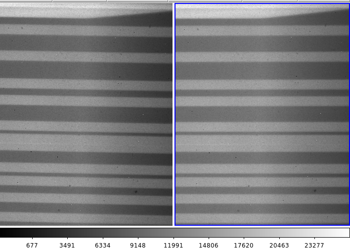
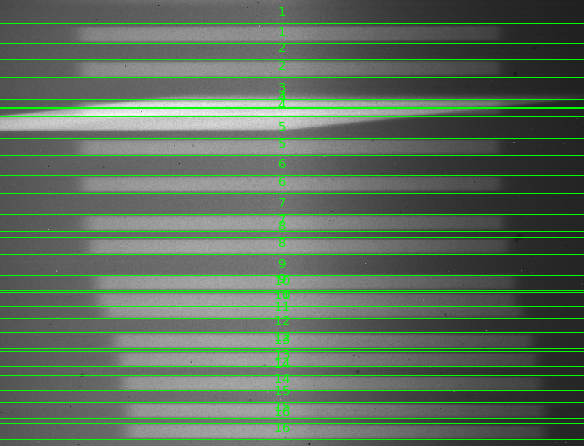
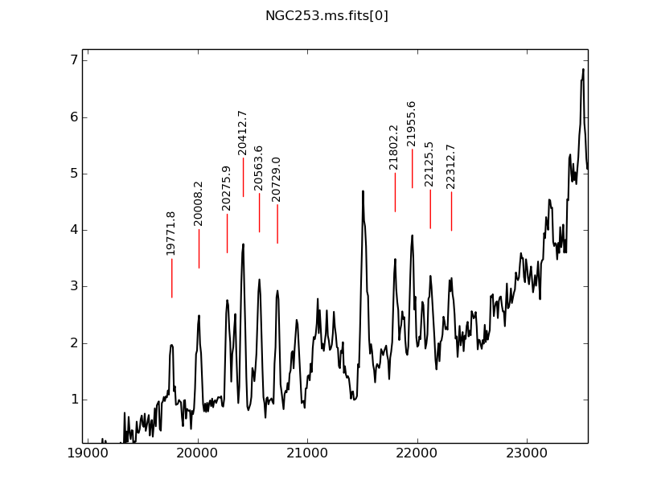
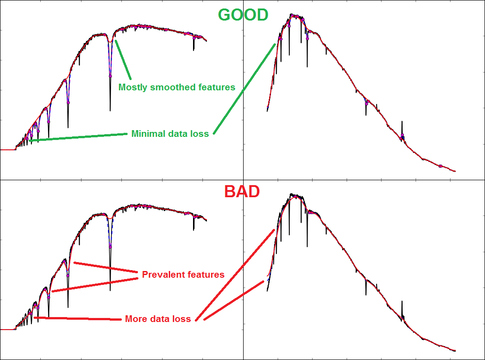

IRMOS-pipeline
==============

Repository for IRMOS data reduction

Requirements
* ```numpy```
* ```skimage```
* ```matplotlib```
* ```scipy```
* ```pyfits```
* ```pyraf``` (and ```iraf```)

## General notes
All programs in the pipeline utilize the python built-in ```argparse``` module, which creates a unified help menu at the terminal.  For all programs, type ```python IRMOS_[].py -h``` to see the proper usage.

Clone the repo locally:
```git clone https://github.com/msgordon/IRMOS-pipeline.git```

## Reduction steps
### BITPIX fix
The Java FITS writer from STScI neglects to add the 'BITPIX' keyword to the headers, thus rendering the files unreadable.  The following method simply updates the headers of input archive images:

```python IRMOS_bitfix.py \path\to\files\*.fit```

### Image combining
For each set of observations, there are 6 types of images each with the same split positions:

| Name | Description |
| ------- | ----- |
| Source | targets |
| Source Dark | target darks |
| Flat | flat lamp |
| Flat Dark | flat lamp darks |
| Neon | cal lamps |
| Neon Dark | cal lamp darks |

Each set must be combined individually. Refer to the observation log to find the file numbers of each set and feed those into ```IRMOS_combine.py```:

```python IRMOS_combine.py \path\to\files\ basename num_start num_end outfile.fit```

E.g. If the flat darks are files [```'\raw\NGC253_7.fit'```, ```'\raw\NGC253_8.fit'```, ```'\raw\NGC253_9.fit'```], the command would read:

```python IRMOS_combine.py \raw NGC253_ 7 9 FlatDark.fit```

### Image normalization
Each file run through ```IRMOS_combine.py``` will be normalized by exposure time.  For anything else, the normalization should be performed using:

```python IRMOS_expnorm.py file.fit```

### Image arithmetic
The appropriate darks must be subtracted from the appropriate data set.  For each image type (source, flat, neon), use ```IRMOS_imarith.py``` to perform the subtraction:

```python IRMOS_imarith.py file1.fit file2.fit output.fit -method sub```

### Cosmic clean
Like most CCDs, the IRMOS camera suffers from hot and dead pixels.  Using an implementation of Pieter Van Dokkum's [LA Cosmic](http://www.astro.yale.edu/dokkum/lacosmic/) routine, ```IRMOS_clean.py``` cleans input images of cosmic rays and hot/dead pixels all at once.

```python IRMOS_clean.py \path\to\files\*.fit [-o outdir]```

### Image derotation
The CCD and the grating mirror are actually at an angle inside IRMOS, which forces the spectra from each slit to fall on the camera at an angle. Therefore, to extract the spectra, the image plane must first be derotated so the dispersion is horizontal.

**NOTE:** At the time of this writing, we assume all slit positions are vertical, so the resulting spectra spill roughly horizontal across the image plane. The correction angle has been hardcoded to 1.15 degrees.

Derotation is performed as follows:

```python IRMOS_derotate.py \path\to\files\*.fit [-o outdir]```



### Region file
Aperture regions need to be defined for each spectrum. Ideally, we would perform automated aperture extraction on the flat image, since these spectra are usually the brightest with well-defined edges.

**NOTE:** At the time of this writing, we never fully completed the contouring and edge-detection algorithm to locate the apertures automatically.  DS9 regions can be made manually, but the pipeline expects a very specific format. An example region file has been included. Essentially, adjacent lines are read as top and bottom pixels of each aperture cut.

Open one of the source images and load the provided ```.reg``` file to check if the aperture regions are appropriate. The lines can be shifted and the region file re-saved without altering the IRMOS-expected region syntax.



### Flat fielding
Each aperture must be flat-fielded separately. This is performed by extracting each aperture from the region file, median-squishing each aperture into a single row, Gaussian-smoothing that row, and then dividing the entire aperture by that smoothed row.  The resulting image is normalized around 1.0, where non-aperture regions are exactly 1.0 for convenient division later.

To build the flat-field, perform the following:

```python IRMOS_flatfield.py flat.fit region.reg FLATFIELD.fit```

Then, divide the dark-subtracted source image by the flatfield and output the result:

```python IRMOS_imarith.py SOURCE.fit FLATFIELD.fit outfile.fit -method div```

### Aperture extraction
After confirming that the region file's lines are still oriented correctly on the newly flat-fielded image file, aperture extraction can be performed. This process isolates each aperture, mean-combines them down to 1-dimensional cuts, and writes a new file containing these cuts. Using the flat-fielded image file, the region file, and the handle name for the data set (e.g. ```NGC253``` or ```OMC1```), perform the following:

```python IRMOS_apextract.py sourceFF.fit region.reg set_name```

### Wavelength calibration
We have had great success using OH sky emission features for wavelength calibration.  We have developed a version of ```IRAF identify``` in ```python``` using ```matplotlib``` for an interactive, point-and-click calibration experience.

Target features are identified in an aperture, a linear fit is applied to reconstruct the wavelength dispersion of the chip (future versions will incorporate Chebyshev or Legendre polynomials for a more advanced fit), and the features are written to a local database.  This database can be used to rapidly 're-identify' the same features in another aperture.

This re-identification is performed by cross-correlating the calibrated spectrum and finding first the overall wavelength shift of the spectrum, and then searching locally around each previously identified spectral lines to find the peaks (future versions will fit a Gaussian/Lorentzian/Voight profile to each feature to find the subpixel maxima).

```python IRMOS_identify.py set_name.ms.fits ohlines.dat```



### Spectra calibration
Every 1D aperture cut must now be separated and associated with its own wavelengh data. Perform the following step to create a new directory containing these individual spectra:

```python IRMOS_speccal.py set_name.ms.fits database/set_name.ms.cal outdir```

The specified output directory will now hold a spectrum for each aperture with the appropriate index number and wavelgnth information.

### Sky combination and subtraction
There should now be a number of spectra files representing each aperture from the original image files. However, as seen from the 'Wavelength calibration' step, the emission and absorption features from the sky are still incredibly prominent. In order to obtain clean files that represent just the spectra of the observed object(s), the apertures viewing the sky must be combined and subtracted from the apertures viewing the object(s). The sky spectra files can be mean-combined with:

```python IRMOS_skycomb.py sky1.fits [sky2.fits sky3.fits ...] totalsky.fits```

Once the combined sky file is obtained, it can be subtracted from the object spectra, eliminating the sky features/continua and leaving only the object features/continua.

```python IRMOS_sarith.py object.fits - totalsky.fits outfile.fits```

If there are non-negligible differences across the different sky spectra, the most accurate results are obtained by combining and subtracting only the sky spectra nearby the desired object spectra. At any point, spectrum files can be viewed by using ```quicklook.py```.

### Flux calibration
Lastly, the spectra can be flux calibrated so that the y-axis can represent real units instead of just counts. This process requires a standard star calibration file and a corresponding standard star spectrum taken in the same observation run as the data set in question. The flux is determined by constructing a sensitivity function of the observation using the standard star results, and thus involves comparing the standard star spectrum to its pre-established flux.

Because only the standard star's continuum is needed for calibration, and since any given spectrum requires different smoothing parameters, the first step is to manually determine these parameters. Generally, the default kernel (```10```) and linewidth (```50```) provide a relatively good job of smoothing out the majority of a standard star spectrum's features, but some playing around is necessary for the best results. Alter the ```-k``` and ```-lw``` parameters in the following command to try and obtain a continuum with mostly-smoothed features without sacrificing too much data:

```python flux_utils.py standard.fits [-k kernel] [-lw linewidth]```



With the ideal parameters, the actual flux calibration can be performed. Using the spectrum to flux calibrate, the standard star spectrum, and the standard star calibration file:

```python IRMOS_fluxcal.py spectrum.fits outfile.fits standard.fits standard.dat [-k kernel] [-lw linewidth]```

The code normalizes everything that has not already been normalized, so the keywords for exposure time and noramlization, ```[-key KEY]``` (Default=EXPTIME) and ```[-normkey NORMKEY]``` (Default=NORM), should be specified if not default.
